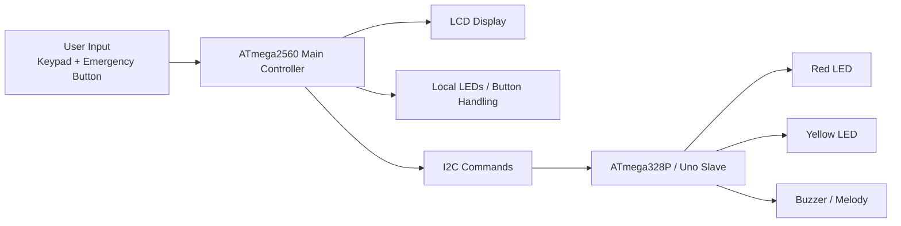

# ATMega-based-evevator-control-system

# Dual-MCU Elevator Control System

An embedded systems project that simulates the core behaviour of a multi-floor elevator using two AVR microcontrollers.

This project was built as a team submission and demonstrates state-machine design, peripheral control, and inter-device communication on resource-constrained hardware.

## Overview

The system is split across two microcontrollers:

- `ATmega2560 / Arduino Mega` acts as the main elevator controller.
- `ATmega328P / Arduino Uno` acts as an I2C slave for lights and buzzer output.

The main controller handles floor input, LCD feedback, elevator movement logic, and emergency handling. The slave controller receives I2C commands and manages LED indicators and melody playback.

## Features

- Multi-floor selection through a 4x4 matrix keypad
- LCD-based user prompts and floor status display
- Door opening and door closing sequences
- Upward and downward movement simulation
- Input validation and fault feedback
- Emergency mode with warning lights, door control, and audible alert
- Inter-board communication over I2C
- Buzzer melody playback on the secondary controller

## System Architecture



## Repository Structure

```text
.
|-- docs/
|   |-- Final_Report_Group_20.pdf
|   `-- project-summary.md
|-- mega-controller/
|   |-- atmel/
|   |   |-- Final_Mega.atsln
|   |   `-- Final_Mega.cproj
|   `-- src/
|       `-- main.c
`-- uno-slave/
    |-- atmel/
    |   |-- Final_Uno.atsln
    |   `-- Final_Uno.cproj
    `-- src/
        `-- main.c
```

## Technical Highlights

- Embedded C development for AVR microcontrollers
- Direct register-level peripheral programming
- LCD interfacing in 4-bit mode
- Matrix keypad scanning
- GPIO-based LED and buzzer control
- I2C master-slave communication
- Interrupt-driven slave-side command handling
- Finite-state behaviour for elevator operation and emergency recovery

## Key Behaviours

### Main Controller

- Accepts floor input from the keypad
- Validates input and rejects invalid floor requests
- Simulates travel between floors with status updates
- Controls door open/close timing
- Detects emergency button presses during idle and travel states
- Sends LED and buzzer commands to the slave board over I2C

### Slave Controller

- Listens as an I2C slave at address `0x10`
- Switches indicator LEDs on and off based on received commands
- Starts and stops melody playback for emergency door-open behaviour

## Development Environment

- Language: `C`
- Platform: `AVR`
- IDE: `Atmel Studio`
- Target boards: `Arduino Mega`, `Arduino Uno`

## Notes

- This repository is organised for portfolio presentation, with source files and project files separated from generated build artifacts.
- The included PDF report provides additional background, implementation notes, and submission context.

## CV-Friendly Summary

Designed and implemented a dual-microcontroller elevator control prototype in Embedded C using AVR hardware. Built a state-driven control system with keypad input, LCD feedback, emergency handling, and I2C-based coordination between a main controller and a peripheral slave responsible for LEDs and buzzer output.
